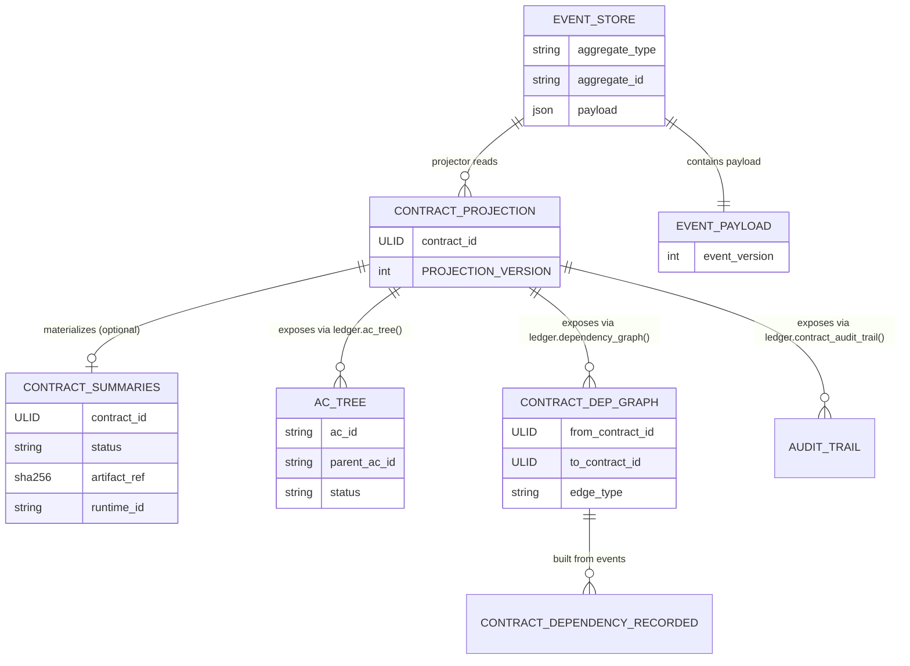
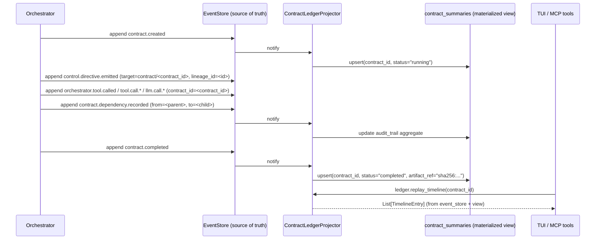

# RFC — Contract Ledger schema

> Status: **Accepted** (Phase 2 of #476 Agent OS roadmap).
> Closes [#513](https://github.com/Q00/ouroboros/issues/513).
> Related: [#319](https://github.com/Q00/ouroboros/pull/319) (recursive AC decomposition / `ac_tree`), [#338](https://github.com/Q00/ouroboros/pull/338) (CheckpointStore), [#436](https://github.com/Q00/ouroboros/pull/436) (`event_version`), [#476](https://github.com/Q00/ouroboros/issues/476) M2 + S4, [#511](https://github.com/Q00/ouroboros/issues/511), [#512](https://github.com/Q00/ouroboros/issues/512).

## Summary

This RFC specifies how the **Contract Ledger** is structured: a `contract_id`-rooted view that combines audit, dependency, and replay over the existing `event_store` and AC read models. CheckpointStore remains a separate pause/resume concern, not a Ledger backing store. The Ledger is the physical backing of the *replay* and *explain* verbs in #476's north star.

A first-pass reading might suggest a new physical store. The RFC takes the opposite stance: the Ledger is **a projection over the existing event journal**, not a new authoritative database. RFC #476 M2 already locked the invariant — *journal is source of truth; live state is a projection* — and the Ledger respects it.

## Scope

This document **does** decide:
- Schema strategy (where data lives, what is canonical, what is a view).
- Dependency edge representation across the existing AC tree and a new contract dependency graph.
- Audit trail composition (raw events vs aggregated summaries).
- Replay API surface (three layers: events / state / timeline).
- Migration plan including opt-in backfill of historical event_store data.

This document **does not** decide:
- Mesh wire format (deferred to [#511](https://github.com/Q00/ouroboros/issues/511)).
- Disposable Memory's storage layout for `artifact_ref` (deferred to [#512](https://github.com/Q00/ouroboros/issues/512)).
- AgentProcess lifecycle verbs (deferred to [#518](https://github.com/Q00/ouroboros/issues/518)).
- The relationship to CheckpointStore beyond stating that the Ledger does not absorb it.

## Inherited from earlier RFCs

| Decision | Source | Used here as |
|---|---|---|
| `contract_id = ULID` | [#511](https://github.com/Q00/ouroboros/issues/511) D2 | Primary key of the Ledger; sortable, log-friendly. |
| `artifact_ref = "sha256:..."` | [#512](https://github.com/Q00/ouroboros/issues/512) C2 | Stored as a reference in the Ledger; bodies remain in the artifact store. |
| `target_type` contract | events/control.py ([#492](https://github.com/Q00/ouroboros/pull/492)) | Free-form string with producers such as `lineage`, `execution`, and `session`; forward-compatible targets like `agent_process` / `contract` may be introduced additively, so ledger projectors must not hard-code a closed enum. |

## Decisions

### L2 — Schema strategy: event_store source + projection layer + optional materialized view

**Decision.**

- **Source of truth (unchanged).** `persistence/event_store.py` — append-only, six event categories today plus the new `contract.*` family from L7.
- **Projection layer (new code).** A `ContractLedgerProjector` reads `event_store` and produces contract-rooted views: AC tree state, dependency edges, audit aggregates, result envelope handles.
- **Materialized view (optional, hot path only).** A `contract_summaries` table populated by the projector at write time. Recoverable from `event_store` at any point; loss of this table never loses information.

**Rationale.** RFC #476 M2 established the invariant *"journal is source of truth; live state is a projection"*. Treating the Contract Ledger as a new physical store would silently violate that invariant. Treating it as a projection respects it. A future projection-logic change becomes a *rebuild* operation, not a *schema migration*. That keeps schema discipline aligned with [#436](https://github.com/Q00/ouroboros/pull/436)'s additive-only rule and #476 S4.

**Risks.**
- Materialized view drift. Mitigation: `ouroboros ledger verify` compares the materialized table against a fresh projection and reports diffs; drift never silently corrupts queries because event_store remains authoritative.
- Projection logic versioning. Mitigation: `ContractLedgerProjector.PROJECTION_VERSION` constant is incremented when projection semantics change; an `ouroboros ledger rebuild` command rebuilds materialized views from the journal.

### L3 — Dependency edges: two graphs, clearly distinguished

`ac_tree` (in `core/ac_tree.py`, materialized by [#319](https://github.com/Q00/ouroboros/pull/319)) describes **static AC decomposition** — recursive parent/child of acceptance criteria. It is a structural artifact, set at decomposition time, immutable for the life of a generation.

A contract dependency graph is something different: **runtime-recorded edges between contracts**. Contract A's result feeds Contract B; Contract B is a sub-contract spawned by Contract A; etc.

**Decision.** Keep the two graphs separate:

- `ac_tree` stays where it is. **No promotion** to "ledger first-class".
- A new event `contract.dependency.recorded(from_contract_id, to_contract_id, edge_type)` captures runtime contract dependencies.
- `edge_type` initial vocabulary (additive):
  - `result_input` — A's result envelope feeds B
  - `parent_ac` — B is a sub-contract spawned to satisfy a sub-AC of A
  - `lineage_continuation` — synthetic backfill edge linking adjacent lineage generations when predecessor evidence is known
- The `ContractLedgerProjector` exposes both graphs through *separate* accessors:
  - `ledger.ac_tree(contract_id) → ACTree` (full decomposition tree/state for the contract's AC scope)
  - `ledger.dependency_graph(contract_id) → ContractDependencyGraph`

**Distinction at a glance.**

| Graph | Level | When set | Mutability |
|---|---|---|---|
| AC tree | per AC | at decomposition | immutable for the generation |
| Contract dependency | per contract | at runtime emission | grows during the run |

**Rationale.** Conflating the two graphs causes confusion that compounds over time. Same word ("dependency") refers to two different things; the RFC body's distinction table is the canonical reference for future readers.

### L5 — Audit trail: raw 1:1 + projected aggregates

**Decision.**

- **Raw layer.** `control.directive.emitted` events stay 1:1, exactly the current shape [#492](https://github.com/Q00/ouroboros/pull/492) sets up. No collapsing, no compaction. The current #492 payload carries the directive target, emitter, directive, reason, terminality, optional first-class correlation fields, and `extra`; it does **not** yet carry a first-class `caused_by` field.
- **Aggregated layer.** `ContractLedgerProjector` exposes `contract_audit_trail(contract_id)` which folds the raw events into a per-contract narrative (timeline, terminal directive, retry budget consumed, etc.).

**Rationale.** RFC #476 M2's acceptance test is *"every control decision persists `{who, what, why, when, caused_by}`"*. The Ledger preserves today's raw directive rows 1:1 and makes causal linkage an additive follow-up requirement for contract-serving directive emitters: when a decision is caused by a contract/runtime event, the emitting site must populate a future first-class `caused_by` (or an explicitly documented equivalent correlation field) before consumers rely on causal ordering. Until that field exists on a row, the projector may include it in the audit trail but must not pretend Layer 0 contains causal edges. M2 also requires *"any past session's directive timeline reconstructs from a single SQL query"* — that requires aggregated views. Both can be satisfied without choosing between them: keep raw events 1:1 and let the projector aggregate only the fidelity actually present in the journal.

This is the same shape as L2 — raw lives in the journal, aggregates live in the projection.

### L6 — Replay API: three layers, same source

`replay(contract_id)` is not a single signature, because three different consumers want three different shapes:

```python
# Layer 0 — contract-correlated raw events. Always available, idempotent.
events: list[BaseEvent] = ledger.replay_events(contract_id)

# Layer 1 — reconstituted state (uses the projector).
state: ContractState = ledger.replay_state(contract_id)
# state holds: status, ac_tree, dependency_graph, result_envelope_ref,
#              audit_trail aggregates, runtime_id per stage

# Layer 2 — render-ready timeline. The S2 Introspection feed.
timeline: list[TimelineEntry] = ledger.replay_timeline(contract_id)
```

**Layer 0 query rule.** `ledger.replay_events(contract_id)` is not a direct call to the current `EventStore.replay(aggregate_type, aggregate_id)` primitive. It is a Ledger query over the shared event_store that returns every event with one of these correlations, in journal order:

1. `aggregate_type="contract"` and `aggregate_id=<contract_id>` (`contract.*` envelope events).
2. `control.directive.emitted` whose aggregate target is the contract (`target_type="contract"`, `target_id=<contract_id>`). Lineage/session/execution context, when needed, stays in the existing first-class payload correlation fields (`session_id`, `execution_id`, `lineage_id`, `generation_number`, `phase`); `extra` is only for supplemental correlation that has no canonical payload field.
3. Runtime I/O events (today `orchestrator.tool.called`, plus normalized `tool.call.*`, `llm.call.*`, and future runtime event families) whose payload or `extra` contains `contract_id=<contract_id>`; `correlation_id` may be present for ordering/causality but is not a substitute for `contract_id`.
4. For synthetic backfilled contracts, historical rows that do not carry `contract_id` but whose stable invocation boundary maps to the same deterministic synthetic contract key from L7. Generation-only or execution-only ambiguous markers do not pull broad historical rows into Layer 0.

Layer 0 returns this union in the EventStore's current canonical order (`timestamp`, then event UUID `id`). It is a raw audit slice, not a strict causal ordering guarantee across aggregates. Consumers that need causal/rendered order must use Layer 2 `replay_timeline(contract_id)`, where the projector can apply explicit causal fields only when present (`caused_by` or a documented equivalent), then fall back to `correlation_id` and domain-specific ordering rules. A future append-sequence column may strengthen Layer 0 without changing the API shape.

Therefore Step 2's implementation work includes adding contract correlation and stable invocation identity to runtime I/O event factories/adapters whenever work is executing inside a contract. Without that correlation, Layer 0 must omit the event rather than guessing from lineage/session scope; without stable invocation identity, historical backfill must use the conservative ambiguous fallback from L7 rather than claiming deterministic invocation replay.

**Invariants** (re-cited from upstream RFCs so this RFC stays consistent):

- Replay does **not** re-execute LLM calls (#476 M3, [#518](https://github.com/Q00/ouroboros/issues/518) M6).
- Replay does **not** re-fork sub-agents ([#511](https://github.com/Q00/ouroboros/issues/511) D6, [#512](https://github.com/Q00/ouroboros/issues/512) C5).
- Force-rerun = allocate a new `contract_id`. Replay of the existing one is read-only.
- All three layers read from the same `event_store` source. **No private replay store.**

### L7 — Migration plan: five additive steps, opt-in backfill

**Goal.** The 1.0 release ships *without* anyone running a migration. New contracts produce `contract.*` events from day one; historical event_store data becomes Ledger-aware *only if and when* the user opts in.

**Steps.**

```
Step 1 — additive code only
        Introduce ContractLedgerProjector. Read-only over event_store.
        Works against new contract-tagged data immediately, no schema change.
        Historical timelines remain partial until the optional backfill in Step 3.

Step 2 — additive event family + contract-targeted directives
        New factories: contract.created / completed / failed / dependency.recorded.
        Rollout invariant: land and switch lineage/session/execution readers to
        Ledger/projector dual-read helpers before any emitter starts writing
        contract-targeted directives. Only after those readers can join
        contract/<contract_id> directive streams back through the existing
        first-class lineage/session/execution correlation fields may contract-serving
        directive emitters target contract/<contract_id>
        for decisions whose object is the contract. Update current runtime I/O
        producers (`orchestrator.tool.called`) and normalized/future tool.call.* /
        llm.call.* producers to carry contract_id in payload or extra when emitted
        inside a contract, and include a stable invocation identifier such as
        `tool_call_id` on rows that should participate in deterministic historical
        backfill. A single directive decision must still produce one
        control.directive.emitted row; lineage/session/execution context remains
        in the existing first-class payload correlation fields, with extra used
        only for supplemental correlation. Contract-serving directive emitters that
        need causal replay must add/populate a first-class `caused_by` (or an
        explicitly documented equivalent) in the same additive rollout; current #492
        rows without that field remain valid but are not causally ordered by Layer 2.
        Compatibility is provided by the already-landed
        dual-read helpers, not by duplicating directive rows.
        No event_version bump is required for the new contract.* event family;
        the factories use the current payload event_version, and only incompatible
        changes to an existing payload contract bump event_version per #436.

Step 3 — opt-in backfill (operator command)
        Walk historical event_store, infer contract boundaries using the
        deterministic precedence below — stable invocation evidence before any
        conservative ambiguous fallback — and emit missing synthetic contract.* envelope
        events with synthetic=true and extra.backfill_key=<synthetic_contract_key>.
        Historical source rows are not rewritten; Layer 0 maps them through the
        deterministic key rule below. User triggers via:
            ouroboros ledger backfill [--apply]

Step 4 — materialized view (hot path optimization)
        contract_summaries table populated by the projector at write time.
        Recoverable from event_store. Never authoritative.

Step 5 — non-critical consumer migration
        TUI / MCP tools / evaluator surfaces that do not participate in
        lineage/session/execution directive replay move to ContractLedger API on
        their own schedules. Any reader that must render directive audit history
        is already covered by the Step 2 rollout invariant before contract-targeted
        directive writes begin. Legacy direct event_store reads remain valid for
        legacy aggregate-targeted directives, but contract-targeted decisions
        require Ledger dual-read helpers (contract aggregate + first-class
        lineage/session/execution correlation fields) to appear in lineage/session
        views. No storage flag day.
```

**Backfill mapping rule (deterministic first draft).**

Backfill first builds **invocation-boundary clusters** only from fields that are actually persisted on the historical rows being processed, then assigns one synthetic contract key per cluster. The field-priority rule below is evaluated over the whole cluster, not independently per event row: if any row in a correlated historical call has `tool_call_id` (the preferred future/current field for enriched runtime rows) or its legacy/generic alias `call_id`, that selected value becomes the cluster key and sibling rows with only `correlation_id`, `invocation_id`, or `request_id` join the same boundary through shared execution/correlation evidence. Lower-priority fields are aliases used for reconciliation inside the cluster, not alternate contract keys. Rows that cannot be reconciled to a stable invocation boundary fall through to conservative ambiguous markers instead of being merged broadly. In the current snapshot, plain `orchestrator.tool.called` rows persist only session-scoped tool metadata (`tool_name`, `called_at`, optional `tool_input_preview`) and therefore usually cannot take the deterministic invocation-boundary path unless another persisted row supplies the stable evidence.

The deterministic boundary rule is:

1. If an event already carries `contract_id`, use that `contract_id`.
2. Otherwise, if a correlated cluster carries `execution_id` **and** at least one persisted stable invocation identifier, select exactly one stable invocation id for the **cluster** with this fixed field priority: `tool_call_id` first, then `call_id`, then `correlation_id`, then `invocation_id`, then `request_id`. `call_id` is a compatibility alias for older or normalized producers; enriched runtime projections should prefer `tool_call_id` when both are present. Ignore lower-priority fields when a higher-priority field is present anywhere in the cluster. If the selected field is present and non-empty, map every row reconciled into that invocation boundary to `legacy:execution:<execution_id>:attempt:<selected_field_name>:<selected_field_value>`.
3. Otherwise, if it carries `(lineage_id, generation_number)` but no stable invocation boundary selected by rule 2, map only the synthetic envelope marker to `legacy:lineage:<lineage_id>:gen:<generation_number>:event:<first_event_id>` and mark it ambiguous; do **not** merge all rows from that generation into one contract.
4. Otherwise, map it to `legacy:event:<event_id>` and mark it `synthetic=true`, `provenance="backfill:ambiguous"`.

Synthetic records still use `contract_id = ULID`. Backfill derives a deterministic ULID by taking the timestamp from the first event in the synthetic boundary and the 80-bit randomness field from `sha256("ouroboros-backfill:" + synthetic_contract_key)[:10]`. The human-readable `synthetic_contract_key` is stored separately in `extra.legacy_key` / `extra.backfill_key`; it is **not** substituted for `contract_id`. Generation-derived contracts may also emit `parent_ac` or `lineage_continuation` edges when the predecessor generation is known; execution-derived contracts stay execution-scoped unless later evidence links them to a lineage generation.

Backfill is idempotent by event key, not by event UUID. Every synthetic `contract.*` row carries both the boundary-level `extra.backfill_key=<synthetic_contract_key>` and an event-specific `extra.backfill_event_key`. Before appending a synthetic event, the command queries for an existing synthetic event with the same `type`, `contract_id`, and `extra.backfill_event_key`; if present it skips the append. `extra.backfill_key` identifies only the synthetic contract boundary and must never be used as the sole dedupe key for `contract.dependency.recorded`.

Envelope event keys are deterministic literals scoped to the boundary, for example `<synthetic_contract_key>:created`, `<synthetic_contract_key>:completed`, or `<synthetic_contract_key>:failed`. Dependency event keys are edge-specific and additionally include the full edge identity plus source evidence: `<synthetic_contract_key>:dependency:<from_contract_id>:<to_contract_id>:<edge_type>:<source_event_id-or-source_timestamp>`. The dependency event payload also carries those identity fields (`from_contract_id`, `to_contract_id`, `edge_type`, and `source_event_id` / `source_timestamp` or equivalent evidence hash), so a verifier can prove that multiple edges sharing one boundary key are distinct events. A contract with multiple `parent_ac` or `result_input` dependencies appends one synthetic dependency event per distinct edge/source, and rerunning backfill skips only the matching edge event rather than collapsing all dependency history for that contract.

Synthetic envelope rows should use deterministic event UUIDs and historical boundary timestamps because `BaseEvent` accepts caller-provided `id` / `timestamp` values and `EventStore.append()` persists them verbatim. For example, `contract.created` uses the boundary start timestamp and an event key-derived UUID, while `contract.completed` / `failed` uses the boundary finish timestamp and its own event key-derived UUID. This gives Layer 0 the best available raw ordering without rewriting historical rows. The narrower limitation is tie-breaking: if a synthetic envelope and a historical source row share the same timestamp, current replay order falls back to event UUID `id`, so the raw stream still cannot guarantee causal bracketing without a future append-sequence / journal-cursor primitive. Therefore payloads must also carry `historical_started_at` / `historical_finished_at` (and edge source timestamps for dependency events) so Layer 1/2 projectors can render historical order explicitly. The journal remains append-only, and repeated backfill runs do not create duplicate synthetic envelopes or dependency edges for the same historical boundary.

| Existing event evidence | Synthetic contract key | Notes |
|---|---|---|
| Existing `contract_id` | existing `contract_id` | No synthetic identity; projector reads the native contract stream |
| `execution_id` + reconciled stable invocation cluster | `legacy:execution:<execution_id>:attempt:<selected_field_name>:<selected_field_value>` | Preferred historical boundary when native `contract_id` is missing and persisted stable invocation evidence exists; select the cluster key once using `tool_call_id`, then `call_id`, then `correlation_id`, then `invocation_id`, then `request_id`; sibling rows with lower-priority evidence join the selected boundary, not separate contracts |
| `orchestrator.tool.called` rows with only `tool_name` / `called_at` / `tool_input_preview` | `legacy:event:<event_id>` | Current un-enriched tool rows are not stable invocation evidence; mark ambiguous unless another persisted event correlates them into a stable cluster |
| `lineage_id` + `generation_number` without invocation evidence | `legacy:lineage:<lineage_id>:gen:<generation_number>:event:<first_event_id>` | Ambiguous marker only; does not merge an entire generation into one contract |
| `execution_id` only | `legacy:event:<event_id>` | Too broad to infer a contract; use event-level ambiguous fallback |
| Insufficient fields | `legacy:event:<event_id>` | Marked ambiguous and visible in TUI; not silently merged |
| Pre-#492 sessions with no directive events | same key rule, no synthetic directive emission | Backfill records contract envelope but leaves directive timeline empty |

This table is the **first draft**; the L7 sub-thread on [#513](https://github.com/Q00/ouroboros/issues/513) is the canonical place to extend it for additional edge cases without changing the deterministic precedence, conservative no-merge fallback, or ULID derivation above.

**Rationale.** Migrations that require a flag day or destructive schema change tend to be deferred indefinitely; making backfill *opt-in* keeps 1.0 unblocked while preserving the option to retrofit history when a user actually wants it. RFC #476 S4's additive-only rule is honored throughout.

**Risks.**
- Backfill mapping ambiguity. Mitigation: deterministic precedence plus `synthetic=true` + `provenance="backfill:ambiguous"` for fallback event-level contracts makes inferred boundaries visible in the TUI rather than silent.
- Materialized view drift on long-running installs. Mitigation: `ouroboros ledger verify` plus `ledger rebuild`.
- AC tree vs contract dependency conflation. Mitigation: distinct accessors (L3) plus the distinction table above.
- CheckpointStore relationship confusion. Mitigation: this RFC explicitly states the Ledger does **not** absorb [#338](https://github.com/Q00/ouroboros/pull/338)'s CheckpointStore — CheckpointStore stores pause/resume state for AgentProcess, which is a separate concern from the audit Ledger.

## ER-style diagram



## Sequence diagram — one contract's lifecycle through the Ledger

For contract-rooted replay, directive events whose decision object is a contract MUST be written once with `target_type="contract"` and `target_id=<contract_id>`. If the same decision also needs lineage/session/execution context, that context belongs in the existing first-class payload correlation fields (`session_id`, `execution_id`, `lineage_id`, `generation_number`, `phase`); `extra` is reserved for supplemental keys without canonical fields. Implementations must not duplicate the directive row with a second target because L5's raw 1:1 audit invariant would be lost.




## Cross-RFC consistency

| Subject | Source | This RFC's behaviour |
|---|---|---|
| `contract_id = ULID` | [#511](https://github.com/Q00/ouroboros/issues/511) D2 | Inherited; primary key of the Ledger. |
| `artifact_ref = "sha256:..."` | [#512](https://github.com/Q00/ouroboros/issues/512) C2 | Inherited; stored as a reference, never inlined. |
| `replay()` semantics | [#511](https://github.com/Q00/ouroboros/issues/511) D6, [#512](https://github.com/Q00/ouroboros/issues/512) C5 | Honored; no LLM re-execution, no sub-agent re-fork. |
| CheckpointStore boundary | [#338](https://github.com/Q00/ouroboros/pull/338) | The Ledger does **not** absorb CheckpointStore. |
| Additive-only schema | [#436](https://github.com/Q00/ouroboros/pull/436), #476 S4 | Honored throughout L7. |

## Acceptance record

This RFC is marked **Accepted**, so merge/review process state lives on PR #522 rather than as unchecked gates inside the document. The technical acceptance criteria captured by the RFC are:

- [x] All 5 fresh decisions present (L2 / L3 / L5 / L6 / L7) with option + rationale + risks
- [x] Inherited-from list cites [#511](https://github.com/Q00/ouroboros/issues/511) D2 and [#512](https://github.com/Q00/ouroboros/issues/512) C2
- [x] AC tree vs contract dependency graph distinction table present
- [x] Backfill mapping table present with deterministic, conservative ambiguous-boundary handling
- [x] ER + sequence diagrams included
- [x] Cross-references resolve to existing issues / files
- [x] L7 backfill mapping includes ambiguous boundaries (`synthetic=true` + `provenance="backfill:ambiguous"`)
- [x] `replay()` semantics match [#511](https://github.com/Q00/ouroboros/issues/511) D6 (no LLM re-execution) and [#512](https://github.com/Q00/ouroboros/issues/512) C5 (read artifact default)
- [x] CheckpointStore boundary explicit: Ledger does not absorb [#338](https://github.com/Q00/ouroboros/pull/338)

## Post-merge checklist

- [ ] `docs/rfc/contract-ledger.md` reachable from the docs site (or the README index when it lands)
- [ ] Issue [#513](https://github.com/Q00/ouroboros/issues/513) closed with a back-link to this PR
- [ ] At least three Phase F implementation issues opened (Contract envelope object, ledger projections, dependency edge promotion)
- [ ] `ouroboros ledger backfill` and `ouroboros ledger verify` commands listed in the user-facing CLI docs
- [ ] No silent change to existing event_store reads for unaffected consumers; directive-audit readers must use the Step 2 dual-read helpers before contract-targeted directives appear in lineage/session views

## Rollback

Docs PR with no runtime impact. Rollback = revert the docs PR. The proposal comment in [#513](https://github.com/Q00/ouroboros/issues/513) remains as the working draft.
